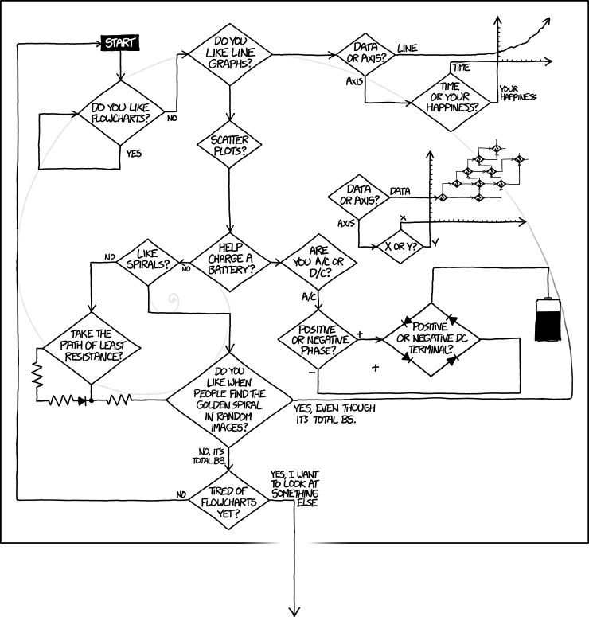

# Overall

Most general comments/thoughts are in the Notes and Thoughts document in the off-line course folder.


# ToDo

* Continue updating Assessment_Data_Analysis
* Update/finish AI unit
* Write table unit
* Update course_tools_intro assessment
* implement data generation/AI assessment


# Notes

## Helpful tip for getting YAML indentations

Any time I work in the `.yml`, I turn on indentation guides. Indentation is so important and so annoying! In RStudio > `Tools` > `Global Options` > `Code` > `Display` > `Indentation Guides` > pick an option from the dropdown menu. I've also commented the number of indents in the examples below for your reference.

## Quarto Conversion notes

### Document metadata

**AH:** 
Currently the time stamp in the Rmd YAML is auto-generated with:
date: "`r file.mtime(knitr::current_input())`"
This doesn't seem to work in Quarto. I would still like to have an auto-generated date. Ideally based on the last time the file was edited (and not as currently the date the file was-reknitted). 

I want the Quarto files to have (at least) these entries:
title: 
subtitle: (mostly empty)
author: 
date: last-modified-date

The bibliography entry can go, I decided to only do inline/link citations for this website, no bibliography/reference manager.

**JR:** 
The following entry in the `_quarto.yml` file applies the author and last modified date to every document besides `index.qmd`:

```
format:
  html: # 1st indent
    author: # 2nd indent
      - name: "Andreas Handel"  # 3rd indent
        affiliation: "University of Georgia"
    date-modified: last-modified  # 2nd indent
```

These can be overwritten in individual .qmd files. I noticed you had your affiliation on most pages so I included it, but you can easily comment it out/remove it.

**AH: I plan to remove affiliation everywhere. Feel free to remove, otherwise I can.** 

JR: removed ✅

### Emojis

Quarto allows you to insert emojis without the `emoji` package. [https://quarto.org/docs/visual-editor/content.html#emojis](https://quarto.org/docs/visual-editor/content.html#emojis)

I replaced your `emoji` calls with just the emoji and removed the library call in `index.qmd`.

**AH: Ok. I rarely use the viusal editor, I assume this works equally well in the text editor version?  And I do want to make sure things are somewhat portable to different formats, e.g. if I want to make (revealjs) slides using some of the text, or for some reason need to create Word or pdf output of some of the text, I'd like things to work as much as possible. I didn't fully understand what they say in the emoji documentation about when/how native emojis are supported. Just want to make sure this is as output-independent as possible.** 

JR: You can insert emojis without the visual editor.
on Windows, the shortcut is `Windows + .`
on Mac: `Ctrl + Cmd + Space`

For output to a different format, add this to the YAML heading of the file.

```
---
title: "My Document"
from: markdown+emoji
---
```

Or, I can switch them back to the `emoji` package if you prefer?

### Navigation

Your site uses hybrid navigation (navbar plus sidebar) as detailed in these [Quarto docs](https://quarto.org/docs/websites/website-navigation.html#hybrid-navigation).

In `_quarto.yml`, under the `website:` level, follow this general structure:

```
  navbar: # 1st indent
    left: # 2nd indent
      - text: "General Information" # 3rd indent
        file: courseinfo/Course_Syllabus.qmd
      - text: "Content"
        file: modules/Introduction_Course.qmd
  sidebar: # 1st indent
      - title: "General Information"  # 3rd indent
        style: "docked"
        collapse-level: 1
        contents:
            - text: "Syllabus"  # 4th indent
              file: courseinfo/Course_Syllabus.qmd
      - title: "Content"
        contents:
          - section: "1. Course and Tools Introduction"
            contents:
              - text: "Course Introduction"
                file: modules/Introduction_Course.qmd
```

Note the text in the navbar matches the title in the sidebar and the files are the same. The sidebar style, collapse-level, and other options don't need to be included in other sidebars (unless you want a different setting for a specific sidebar).

## Cross reference website pages

Use the `.qmd` file rather than the `.html` per the [Quarto docs](https://quarto.org/docs/websites/#linking).

To link between pages **within the same** folder - just use the name of the other file.

Example as seen in `courseinf/Course_Syllabus.qmd`:
`[_Assessments page_](Course_Assessments.qmd)`

To link between pages in **different** folders - use double dots to get to the parent directory and then the desired folder name.

Example as seen in `assessments/Assessment_Course_Tools_Introduction.qmd`:
`[**Schedule**](../courseinfo/Course_Schedule.qmd)`

This way of cross referencing is cool because you can link to specific sections. Add a `#sec-` identifier to any heading per these [Quarto docs](https://quarto.org/docs/authoring/cross-references.html#sections). 

Example as seen in `project/Project_Review.qmd`:

`-   Use the simple grading rubric shown in the part 3 section of the [Project Details](Project_Details.qmd#sec-part-3) document.`

## Contributors - author roles in metadata

In `Data_Exploration.qmd` and `Data_Wrangling.qmd`, you had a contributors field which isn't valid in Quarto. Beginning in Quarto 1.4, authors will have a `role` key available per this [stack overflow Q/A](https://stackoverflow.com/questions/77046856/how-to-get-author-roles-defined-in-quarto-document-to-appear-in-output). So for now both names show as authors.

```
---
title: Exploring Data  
subtitle: ""
authors: 
  - name: Andreas Handel
  - name: Megan Beaudry
    role: "Contributor"
---
```

## Images

You can also use markdown image syntax instead of `knitr::include_graphics()`. It might be more efficient when rendering since it doesn't require execution [Quarto figures](https://quarto.org/docs/authoring/figures.html) though I haven't tested this. Anyway, it's more aligned with "the Quarto way" and `fig-align` is set to center in `_quarto.yml` so it doesn't need to be repeated for each figure.

See the syntax differences below:

````
# From modules/Visualization_Overview.qmd

```{r cartoon-graph,  echo=FALSE, fig.cap='Flowcharts are sometimes, but not always good visualization tools. Source: xkcd.com.', out.width = '60%', fig.align='center', fig.alt='A comic from the website XKCD. It shows an extremely confusing and illogical flowchart which includes a line chart, a battery charging circuit, a resistance diagram, a golden spiral, and an arrow that leads out of the containing box, among other things.'}

```

::: {fig}
{width="60%" fig-alt="A comic from the website XKCD. It shows an extremely confusing and illogical flowchart which includes a line chart, a battery charging circuit, a resistance diagram, a golden spiral, and an arrow that leads out of the containing box, among other things."}
:::
````

**I can adjust these for you, but wanted to check if you would prefer to continue to use knitr::include_graphics().**


**AH: I'm ok doing it the Quarto way. I mostly used the knitr version since it was more robust/flexible across different output formats (e.g., slides, word docs, etc.) compared to the Rmarkdown way. It also allowed more fine control. But it seems Quarto is now as good or better in placement and compatibility, and I like the idea of being somewhat language-agnostic (e.g. if I decided to switch to Julia in the future, it would seem a bit odd to have calls to knitr). So yes, if you think doing figure placement in Quarto gives us all that knitr can do and more, I'm happy to make the switch.**

JR: will do!

## Accessibility
 
Accessibility is really important to me so I thought I'd call attention to some of your hyperlink names. Most are great (concise and descriptive) but some are just called [here] which aren't [helpful link names](https://www.a11yproject.com/posts/creating-valid-and-accessible-links/). 

Not good:

You can find the published paper [here](https://doi.org/10.1098/rspb.2020.0496). All materials to reproduce the full project and all results are available as supplementary material [here](https://doi.org/10.5061/dryad.51c59zw4v).

Good:

Read the [published paper](https://doi.org/10.1098/rspb.2020.0496). All materials to reproduce the full project and all results are available as [supplementary material](https://doi.org/10.5061/dryad.51c59zw4v).

**I can adjust these for you, just let me know if you're okay with it.**

**AH: Agree, making things accessible if possible is a good idea. So yes, feel free to adjust any of those and reword to make it better. (There might be other areas where this is not ideal, for instance I'm not sure I have alt-text for all figures and other embeddings. Feel free to add any of that too if you run into something that you think needs improvement)**

JR: will do!

## Styling

I replaced your `.css` with `.scss`. I changed the primary color to the green from the `?` in the MADA logo.

**AH: I like things to look good, but I'm not much of a styler/designer :), so feel free to improve the looks of everything as much as you like. (Just don't make it too complicated, I don't want to have a lot of overhead/complexity like calling extra packages for fancy fonts or stuff like that)**

JR: got it :)

## Publishing

1. Run `quarto render` in terminal.
2. Commit and push changes.
3. Run `quarto publish gh-pages` in terminal and follow prompts.

# Scribblings
